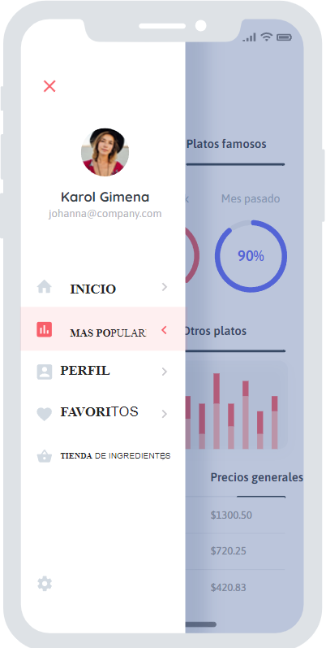

# Diseño de interfaz de usuario

Comenzaremos con la interfaz de usuario de la app GOURMETHUB

Diseño disponible en: Moqups

El diseño completo se esta encuentra disponible en: [Moqups](https://app.moqups.com/703u3a9eS0ZKWc43GqFjnDH89Gifqk2b/view/page/a290bb94e)

## 1. Interfaz de registro

El usuario primero que todo tendrá su pantalla para hacer su posterior registro de datos en la aplicación

 

## 2. Login

Ya luego de su registro, podrá utilizar sus credenciales para hacer el respectivo ingreso en la aplicación. 

## 3. Barra de navegación

Tendremos barra de navegación donde tendremos algunas funcionalidades principales.

## 4. Opción: Popularidad de platos

Acá podremos ver un ejemplo de como se ve la opción "Platos populares", con alguna otra información relacionada con el tema y algunas gráficas.

## 5. Recetas

También tendremos su apartado de "Recetas", donde habrá bastante variedad y diferentes tipos de platos, cada una, claramente con su paso a paso de como hacerlo. 

## 6. Al elegir la receta

Al elegir cualquiera de las recetas, así veremos cómo saldrán estas. Con alguna referencia visual de como se vería junto con su respectivo paso a paso. 

